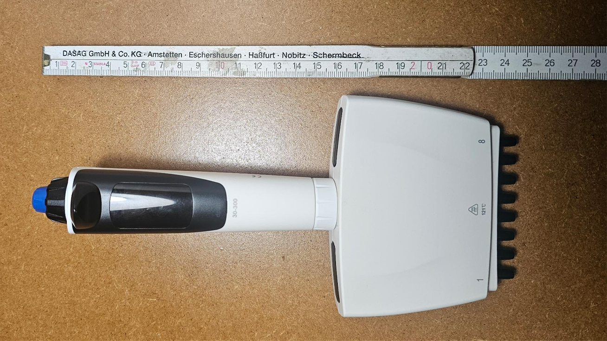

# dpette-usb-driver

[](LICENSE)

[](https://www.codefactor.io/repository/github/lambda-biolab/dpette-usb-driver)
[](https://github.com/Lambda-Biolab/dpette-usb-driver/actions/workflows/codeql.yml)
[](https://github.com/Lambda-Biolab/dpette-usb-driver/actions/workflows/dependabot/dependabot-updates)

Open-source Python driver for **DLAB dPette** and **dPette+** electronic
pipettes. Full serial volume control, speed control, and three operating
modes (pipetting, splitting, dilution) — no hardware modifications needed.

Uses the Silicon Labs **CP2102** USB-UART bridge (VID `0x10C4`, PID `0xEA60`)
at 9600 baud 8N1.



*Verified on the 8-channel dPette — same CP2102 bridge, same 6-byte protocol.*

## Why this matters

There is **no open-source, disposable-tip, API-controlled pipette** at
this price point.

| System | Price tier | Tips | Control | 1P source |
|---|---|---|---|---|
| **dPette + this driver** | **~$80–130 (Aliexpress / DLAB direct)** | **Disposable** | **Full serial** | this repo |
| [ac-rad Digital Pipette](https://github.com/ac-rad/digital-pipette) | DIY (BOM not published) | Syringe (no tips) | Arduino + Python host | [github.com/ac-rad/digital-pipette](https://github.com/ac-rad/digital-pipette) |
| [Science Jubilee + OT-2 pipette](https://science-jubilee.readthedocs.io/en/latest/building/pipette_tool.html) | DIY (system cost not published) | Disposable | Python (`science_jubilee`) | [science-jubilee.readthedocs.io](https://science-jubilee.readthedocs.io/en/latest/building/pipette_tool.html) |
| [Opentrons OT-2](https://opentrons.com/products/ot-2-robot) | From $15,950 | Disposable | Python (Protocol API) | [opentrons.com](https://opentrons.com/products/ot-2-robot) |
| [Tecan Fluent](https://lifesciences.tecan.com/fluent-laboratory-automation-workstation) | Quote only | Disposable | FluentControl (proprietary); PyLabRobot wraps | [tecan.com](https://lifesciences.tecan.com/fluent-laboratory-automation-workstation) |
| [Hamilton Microlab STAR](https://www.hamiltoncompany.com/microlab-star) | Quote only | Disposable (CO-RE II) | VENUS / PyHamilton | [hamiltoncompany.com](https://www.hamiltoncompany.com/microlab-star) |

*Prices verified 2026-05-26 against vendor/project pages linked above.*

## What works

- **Volume-controlled aspirate/dispense** — set any volume via serial (B2), confirmed in EXP-050
- **Three operating modes** — PI (pipetting), ST (splitting), DI (dilution)
- **Speed control** — 3 speed levels for aspirate and dispense
- **Mixing** — aspirate/dispense cycling with caller-controlled tip position
- **EEPROM read/write** — firmware version, calibration coefficients
- **Single- and multichannel** — verified on the 8-channel dPette
- 94 tests passing, 55 experiments documented

## Quickstart

```bash
git clone https://github.com/Lambda-Biolab/dpette-usb-driver.git
cd dpette-usb-driver
uv pip install -e .
```

### Aspirate and dispense

```python
from dpette import DPetteDriver, SerialConfig

drv = DPetteDriver(SerialConfig(port="/dev/cu.usbserial-0001"))
drv.connect()           # A0 handshake + enter PI mode

drv.aspirate(200.0)     # sets volume to 200 µL, aspirates
drv.dispense()          # dispenses

drv.aspirate(50.0)      # change volume on the fly
drv.dispense()

drv.disconnect()
```

### Mixing

```python
# Tip must be raised above liquid before dispense
# (blow includes piston return that creates suction)
for _ in range(5):
    # lower tip into liquid
    drv.mix_aspirate(100.0, speed=3)
    # raise tip above liquid
    drv.mix_dispense()
```

### Splitting (aliquots)

```python
from dpette.protocol import WorkingMode

drv.split_setup(100.0, count=3)   # enters ST mode, sets 100 µL × 3

# tip in liquid
drv.split_aspirate()               # aspirates total (300 µL)

# raise tip, move to destination wells
drv.split_dispense()               # aliquot 1
drv.split_dispense()               # aliquot 2
drv.split_dispense()               # aliquot 3
```

### Dilution

```python
drv.dilute_setup(200.0, 100.0)    # enters DI mode

# tip in diluent
drv.dilute_aspirate()              # aspirates 200 µL

# tip in sample
drv.dilute_aspirate()              # aspirates 100 µL on top

# raise tip — switch to PI mode to dispense (DI blow
# doesn't trigger motor on basic dPette)
drv.enter_mode(WorkingMode.PI)     # homes motor, expels liquid
```

### Speed control

```python
from dpette.protocol import KeyAction

drv.set_speed(KeyAction.SUCK, 3)  # fast aspirate
drv.set_speed(KeyAction.BLOW, 1)  # slow dispense
```

### Run tests (no hardware needed)

```bash
pytest                  # 94 tests
ruff check src/ tests/  # lint
mypy src/               # type check
```

## Protocol

All communication uses 6-byte packets:

```text
[0xFE] [CMD] [B2] [B3] [B4] [CHECKSUM]   host → device
[0xFD] [CMD] [B2] [B3] [B4] [CHECKSUM]   device → host
```

Checksum = `sum(bytes[1:5]) & 0xFF`.

Commands cover handshake (`A0`), EEPROM read/write (`A3`/`A4`), mode and
volume control (`B0`/`B2`), and aspirate/dispense (`B3`). See
[docs/PROTOCOL_NOTES.md](docs/PROTOCOL_NOTES.md) for the full command
reference.

## Known issues

- **Err4 on startup**: Caused by `A5 b2=1` (calibration mode entry via
  serial). Persists across reboots. Cannot be cleared via serial — the
  error has never been resolved, including via PetteCali (Windows).
  Dismiss by holding the button. All serial operations work normally
  after dismissal.
- **DI mode dispense**: B3 blow doesn't trigger motor on basic dPette.
  Workaround: `enter_mode(WorkingMode.PI)` homes the motor and expels liquid.
- **Piston return suction**: B3 blow includes a piston return to home.
  If the tip is submerged, this draws extra liquid. Always dispense with
  tip above liquid.

## Safety

> **WARNING:** This software is provided as-is for research and educational
> purposes. Using it may void your pipette's warranty.
>
> **Do NOT send `FE A5 01`** (enter calibration mode) — causes persistent
> Err4. The driver never sends this command.

## Documentation

- [Protocol Notes](docs/PROTOCOL_NOTES.md) — full command reference
- [Experiment Log](docs/EXPERIMENT_LOG.md) — 55 experiments with results
- [Hardware Notes](docs/HARDWARE.md) — CP2102, device connection
- [Safety Model](docs/SAFETY_MODEL.md) — risks and software guardrails

## Related work

- [PyLabRobot](https://github.com/PyLabRobot/pylabrobot) — hardware-agnostic
  Python SDK for floor-standing liquid handlers (Hamilton STAR/Vantage,
  Tecan EVO, Opentrons OT-2). Different tier; same Python-first goal.
- [xg590/Learn_dPettePlus](https://github.com/xg590/Learn_dPettePlus) —
  earlier independent reverse-engineering of the same dPette+ protocol;
  source of the official `Communication_Protocol_CN.doc`.
- [qte77/i3mega-pipettebot](https://github.com/qte77/i3mega-pipettebot) —
  downstream: drives a converted consumer 3D printer using this driver
  as a low-cost dispensing robot.

## Acknowledgments

The official DLAB serial protocol document (`Communication_Protocol_CN.doc`)
was found in [xg590/Learn_dPettePlus](https://github.com/xg590/Learn_dPettePlus)
by Xiaokang Guo (NYU). This document was the key to discovering the remote
control protocol (A0/B0/B2/B3) that enabled serial volume control — the
single biggest breakthrough in this project.

## License

MIT — see [LICENSE](LICENSE).
